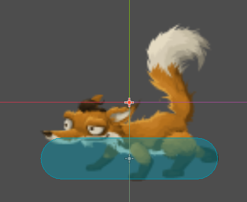
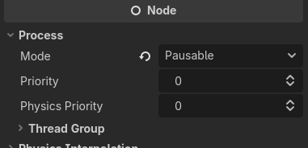
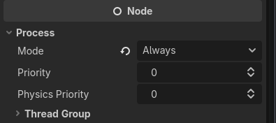
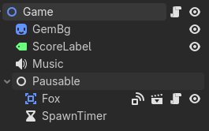

# Lo que Aprendí en Dice Catcher 🎲

¡Hola! Este es mi primer juego desarrollado en **Godot 4**. En este documento detallo los conceptos, mecánicas y flujos de trabajo que aprendí y puse en práctica durante el desarrollo de este proyecto, con el fin de mostrar mi proceso de aprendizaje y cómo resuelvo problemas.

---

## 🛠️ Conceptos Básicos e Importación de Recursos
Al ser mi primer videojuego, comencé poniendo en práctica las tareas típicas de importación y estructuración:
- Importar recursos (texturas, fuentes de texto, archivos de audio).
- Crear y estructurar escenas utilizando la jerarquía de nodos en Godot.

---

## 🎲 Escena del Dado (`Dice.tscn` / `Dice.gd`)
El dado es un objeto que cae constantemente desde la parte superior de la pantalla y gira sobre su propio eje.
- **Tipo de Nodo:** Utilicé un nodo de tipo `Area2D` ([Dice.tscn](Scenes/Dice/Dice.tscn) / [Dice.gd](Scenes/Dice/Dice.gd)) para poder detectar colisiones e interactuar con él.
- **Interacción y Colisión:** Aprendí que todo `Area2D` requiere de un `CollisionShape2D` para interactuar con otros objetos en el juego. En este caso, configuré un recurso `CircleShape2D` ([DiceCollisionShape.tres](Resources/DiceCollisionShape.tres)) con un radio de `38.0`.
- **Lógica de Caída y Rotación:**
  - En la función `_physics_process()`, el dado se desplaza hacia abajo de forma perpetua a una velocidad constante (`SPEED = 100.0` px/s) multiplicada por `delta` para garantizar un movimiento uniforme independiente de los frames por segundo (FPS).
  - El dado gira a una velocidad constante (`ROTATION_SPEED = 5.0`). Para hacerlo más dinámico, en la función `_ready()` agregué una probabilidad del 50% de que gire en sentido horario o antihorario (`rotation_direction *= -1`).
- **Lógica de Fin de Juego (Game Over):** Si el dado supera el tamaño de la pantalla en el eje `Y` (cayendo al suelo sin ser atrapado por el jugador), el dado emite la señal personalizada `game_over` y se auto-elimina del árbol usando `queue_free()`.

Aquí se puede ver la escena estructurada y su comportamiento:

---

## 🦊 Escena del Zorro / Player (`Fox.tscn` / `Fox.gd`)
El zorro es el personaje que controla el jugador para atrapar los dados que caen.
- **Tipo de Nodo:** También es un `Area2D` ([Fox.tscn](Scenes/Fox/Fox.tscn) / [Fox.gd](Scenes/Fox/Fox.gd)) con su respectivo `CollisionShape2D` (un `CapsuleShape2D` rotado horizontalmente).
- **Sonido al Detectar Entrada:** Lo que repasé aquí fue colocar un sonido cuando se detecta que algo entra en el área del zorro. Como solo necesita detectar esto en sí, usar un `Area2D` fue ideal.
- **Movimiento del Jugador:** Se controla directamente dentro de `_physics_process()` utilizando `Input.get_axis("ui_left", "ui_right")`. Si hay movimiento, el personaje se desplaza en el eje `X` a una velocidad configurable (`speed = 200.0`).
- **Giro del Personaje (Flip Sprite):** Para simular que el zorro mira en la dirección a la que se mueve, se invierte el sprite en relación con su dirección: `sprite_2d.flip_h = (move > 0.0)`.
- **Detección y Sonido:** El zorro detecta la colisión mediante la señal `area_entered` que conecté en la escena. Si el área que entra es del tipo `Dice`, se ejecuta la lógica:
  1. Reproduce un efecto de sonido de comida (`Sounds.play()`).
  2. Elimina el dado atrapado (`area.queue_free()`).
  3. Emite una señal personalizada llamada `dice_caught` para avisar al juego que sume un punto.

---

## 📡 Manejo de Señales (Signals)
Aprendí más sobre el uso de las señales manejadas en las propias escenas para comunicar eventos sin acoplar fuertemente los scripts:
1. **`game_over` (en `Dice.gd`):** Emitida por cada dado cuando sobrepasa el tamaño de la pantalla en el eje `Y` (cae al piso sin ser atrapado por el jugador).
2. **`dice_caught` (en `Fox.gd`):** Emitida por el jugador al momento de detectar una escena `Dice` en su área de colisión.

---

## 🎮 Escena Principal y Lógica General (`Game.tscn` / `Game.gd`)
La escena principal ([Game.tscn](Scenes/Game/Game.tscn) / [Game.gd](Scenes/Game/Game.gd)) coordina todo el flujo del juego:
- **Instanciación Dinámica:** Instancia una escena `Dice` cada cierto tiempo de manera aleatoria por encima de la pantalla (en el eje `Y` a `-MARGIN`) utilizando un `Timer`.
- **Posicionamiento Aleatorio:** Cada dado aparece con una posición `X` aleatoria calculada dentro de los límites del viewport (evitando que aparezcan muy al borde gracias a un `MARGIN` de `80.0` píxeles).
- **Conexión de Señales:** Al instanciar cada dado, el script de Game se conecta a la señal `_on_game_over` que cada `Dice` emite, así como a la señal `_on_dice_caught` del zorro para contar los puntos e incrementar el score.
- **Música y Audio:** Adicionalmente, cuenta con la música de fondo (`tetris.mp3`) que se detiene cuando ocurre el Game Over para reproducir el efecto de sonido de derrota (`GAME_OVER`).

Aquí se puede ver el gameplay del juego en acción:

---

## ⏸️ Grupos y Sistema de Pausa Dinámico
Para pausar los elementos correctos del juego al perder y permitir reiniciar la partida, aprendí dos técnicas importantes:
1. **Uso de Grupos:** Coloqué las escenas `Dice` y `Fox` dentro del grupo `"stoppable"`. Esto me permitió aprender cómo buscar y detener estos nodos directamente desde código usando `get_tree().get_nodes_in_group("stoppable")` y desactivando sus físicas (`set_physics_process(false)`).
2. **Uso de la Propiedad `Process Mode`:** Más adelante, aprendí una mejor alternativa de diseño separando los nodos pausables en el árbol de escenas:
   - **Always (Modo 3):** El nodo raíz `Game` se configura con `process_mode = PROCESS_MODE_ALWAYS`. Esto permite que, aunque el árbol del juego se pause con `get_tree().paused = true`, la lógica de `Game.gd` siga funcionando y detectando la tecla de reinicio (`restart`) en `_unhandled_input()`.
   - **Pausable (Modo 1):** Agrupé todos los nodos de gameplay (el zorro `Fox`, el temporizador `SpawnTimer`, y los dados que se van agregando dinámicamente) bajo un nodo común llamado `Pausable` con `process_mode = PROCESS_MODE_PAUSABLE`.
   - Al ocurrir un Game Over, simplemente llamo a `get_tree().paused = true`. Esto congela automáticamente a todos los descendientes de `Pausable` sin pausar el nodo principal `Game`, lo que nos permite un reinicio del nivel simple y limpio.

	
	* Por su parte la escena principal se le coloca que no se pause.
	
Y así es como se ve la separación en el árbol de escenas para aislar lo que se pausa:

# MCP addon

Probe el addon de "godot_mcp_server" y vi que puede crear escenas y manejar el codigo de los scripts, sin emabargo resulta mejor crear uno mismo las escenas porque sino no se le coloca un uid, la creacion por el agente no funciona de la misma manera.
Sin embargo que un agente tenga el contexto de el proyecto siempre es una ayuda para que funcione como una herramienta que permite planear o comprender como implementar una nueva funcionalidad.